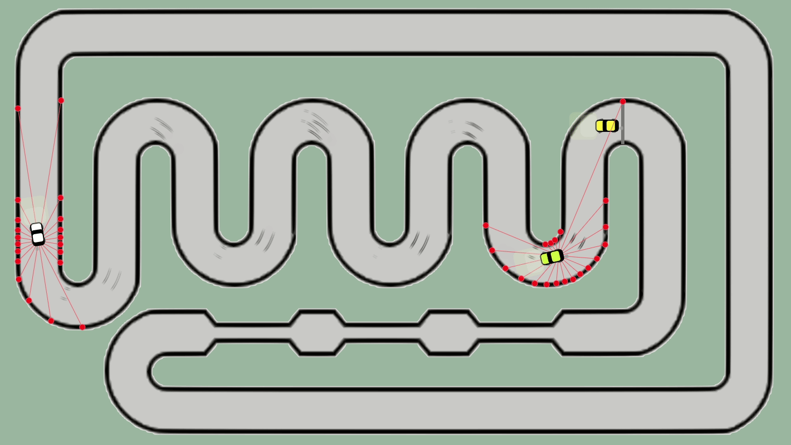
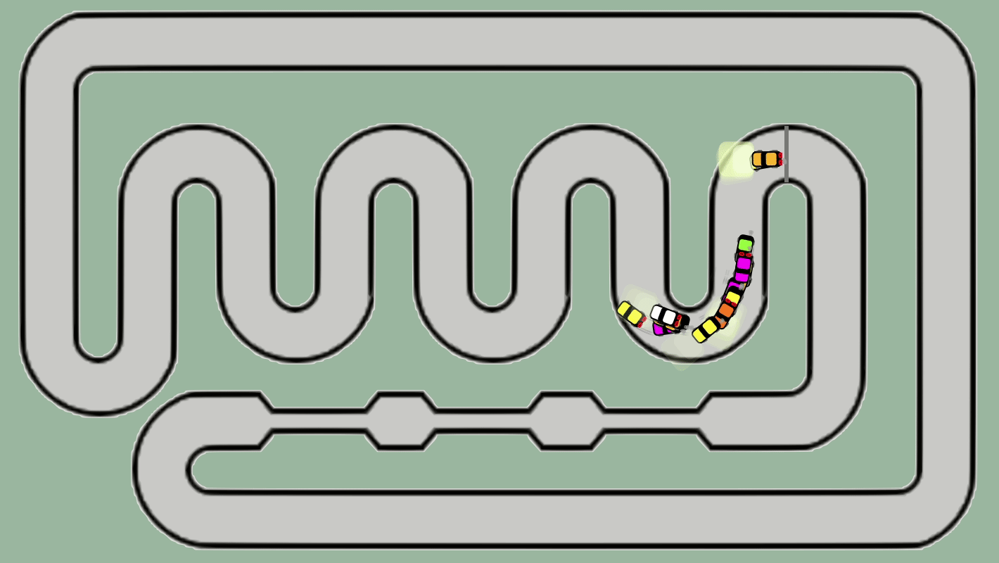
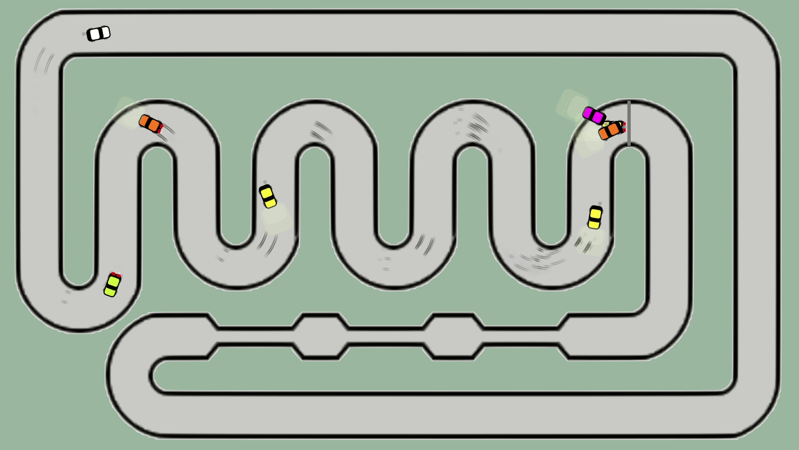
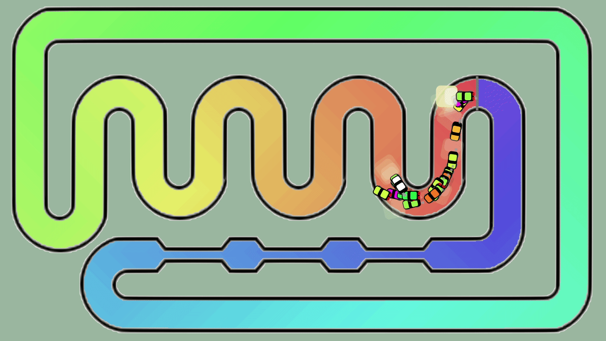

Sensors (See more animations below)

# Cars-AI  

This project uses Google TensorFlow for the car's neural network.

The genetic algorithm selects the first one, clones it to generate the next generation in addition to keeping its superior and adding a new random one.

## 🚀 To run

Download the code and run the src/index.html on browser.

⚡️ Do you want to save learning?

It's not necessary to work but if you want to save automatically the weights then before to start file:///home/cars/src/index.html on browser you need to run "node main.js" on terminal, take a look above:

Run the server with:
~~~js
cd src/server    
node main.js
Server is running on http://localhost:1905
~~~

Do you want to put server on Pm2?

~~~bash
src/server>pm2 start "node main" --name car-1905 # Add
src/server>pm2 save # Save for OS restart case
src/server>pm2 restart car-1905 # Restart if necessary
src/server>pm2 delete car-1905 # Delete if necessary
~~~

⚡️ Do you want to receive messages on your telegram about the cars progress?

You need to create a bot on Telegram and get its token and user id first.

Rename file .env.example to .env and then configure these variables like examples below:

~~~js
TELEGRAM_TOKEN="5769999991:AalskdjfhaldskfjhasdfgddxW9xK-EJHJHI"
TELEGRAM_USERID="8989898986"  
SERVER_HOST=localhost  
SERVER_PORT=1905
~~~

After remake your command: node main.js

Start runway

Braking

Heat map

Track 3 with information about the cars

Track 3 runway heatmap

Track 4

Command keys:

Key    | Action
-------|-----------------
1      | Toggle scoreboard show
a      | Ends generation when hit finish line
b      | Trainig mode, stop rendering the things to improve training performance
**c**      | **Change track layout**
e      | Enables/disables elitism
f      | Shows crashed cars
g      | Shows the background
h      | Shows car details
i      | Shows information about the car
j      | Shows the heat map of the track
k      | Stop create new cars if the current race has a record
l      | Shows the limits of the track
m      | Deletes all vehicles
n      | Show flag
o      | Activates collision between cars
p      | Pause
q      | Start using saved weights or not
r      | Deletes all vehices clearing weights to start from the zero
s      | Shows sensors
t      | Stop the 'timer'
w      | Toggle slot display
x      | Stop create new cars
y      | Enables/disables engine sound
z      | Lights 
\*      | Manual learning
UP     | Accelerate
DOWN   | Brake
D      | Dynamic gear
R      | Reverse gear
3      | Show trace
4      | Add second last car into track
5      | Add thirth last car into track
6      | Add fourth last car into track

 
